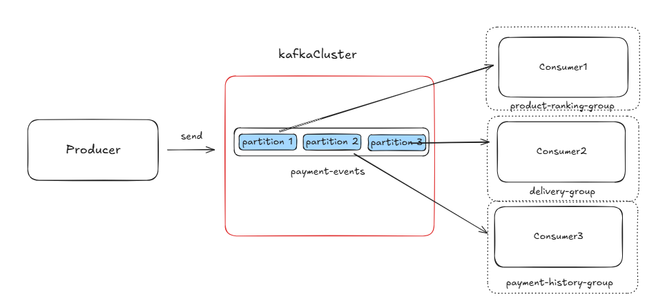
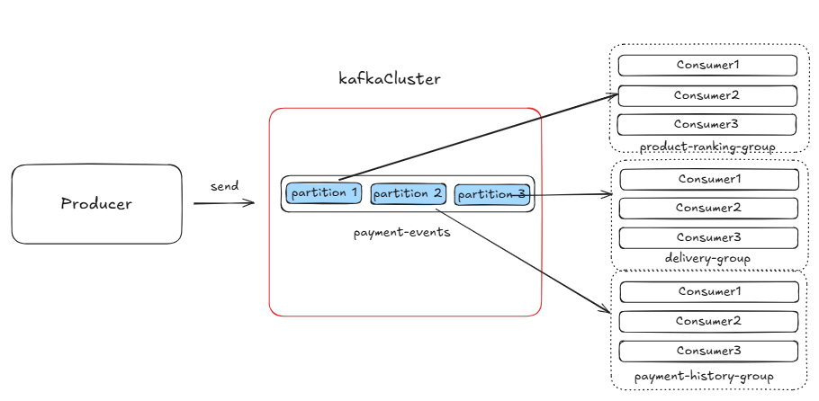

# kafka-redis

## 프로젝트 소개

* 결제 완료 이벤트를 Kafka로 발행하고, 이를 기반으로 배송 생성, 결제 내역 저장, 상품 랭킹 집계를 수행하는 이벤트 기반 실습 프로젝트다.
* `payment-completed` 토픽에 발행된 이벤트를 각 컨슈머 그룹이 비동기로 소비해 기능을 분리하고,** 메시지 큐 기반**의 **느슨한 결합 구조를 학습**한다.
* 배송 데이터는 `MySQL`에 저장하고 `Redis` 에 캐시하여 조회 성능을 개선한다.
* 상품 랭킹은 `Redis ZSET` 으로 집계해 **실시간** `TOP N` 조회를 지원한다.
* Kafka 3-broker KRaft 클러스터와 Redis/RedisInsight를 compose로 구성해 로컬에서도 분산 환경을 재현한다.

## 주요 관심사

* `Kafka` **비동기 메시징**으로 결제 완료 이벤트를 발행하고, 각 기능이 독립적으로 처리하도록 구성
* 메시지 큐 기반 분산 처리로 서비스 간 결합도를 낮추고 처리량 확장성을 확보
* **Redis 캐시**로 배송 조회의 응답 속도를 향상
* Redis ZSET 기반 **실시간 랭킹 집계 및 조회**

## 시스템 흐름

1. 결제 완료 API 호출
2. `PaymentCompletedEvent` 생성 및 Kafka 발행
3. 배송 생성(Delivery), 결제 내역 저장(PaymentHistory), 상품 랭킹 집계(ProductRanking)
4. 배송 조회 API는 Redis 캐시를 우선 조회, 미스 시 DB 조회 후 캐시 반영

## API 명세

### 1. 결제 완료 이벤트 발행

`POST /api/payment/completion`

요청 바디

```json
{
  "orderId": 1001,
  "paymentId": 5001,
  "productId": 2001,
  "userId": 3001,
  "category": "FOOD",
  "quantity": 2
}
```

응답

- 200 OK (본문 없음)

설명

- 요청을 기반으로 `PaymentCompletedEvent`를 생성해 Kafka `payment-completed` 토픽에 발행한다.

### 2. 배송 목록 조회

`GET /api/delivery?userId={userId}`

요청 파라미터

| 이름 | 타입 | 필수 | 설명 |
| --- | --- | --- | --- |
| userId | Long | Y | 사용자 ID |

응답 예시

```json
[
  {
    "deliveryId": 10,
    "orderId": 1001,
    "productId": 2001,
    "deliveryStatus": "PREPARED",
    "statusUpdateAt": "2025-01-09T12:34:56"
  }
]
```

설명

- Redis 캐시 우선 조회 후, 캐시 미스 시 DB에서 조회하여 응답한다.

### 3. 오늘의 상품 랭킹 조회

`GET /api/ranking/product/today`

응답 예시

```json
[
  {
    "title": "상품A",
    "score": 42.0
  },
  {
    "title": "상품B",
    "score": 35.0
  }
]
```

설명

- Redis ZSET에 집계된 랭킹 데이터를 반환한다.

## 기술 스택 및 인프라

- Java 17, Spring Boot 3.5
- Spring Data JPA, Spring for Apache Kafka, Spring Data Redis
- MySQL, Redis
- Kafka 3-broker KRaft 클러스터, Kafka UI, RedisInsight
- Kafka 문서: https://kafka.apache.org/documentation/
- Redis ZSET 문서: https://redis.io/docs/latest/develop/data-types/sorted-sets/

## 트러블 슈팅

### 메시지 처리 구조 개선 메모

현재 소스는 토픽 파티션 3개, 컨슈머 그룹당 컨슈머 1개 구성이라 한 컨슈머가 3개 파티션을 모두 할당받아 순차적으로 처리한다. 트래픽이 증가하면 이 단일 컨슈머의 처리량이 병목이 되어 컨슈머 lag이 누적될 수 있다. 


따라서 컨슈머 그룹 내 컨슈머 수를 3개로 늘리면 각 컨슈머가 파티션을 하나씩 맡아 병렬로 소비하게 되고, 처리량을 높이며 lag을 줄일 수 있다.
